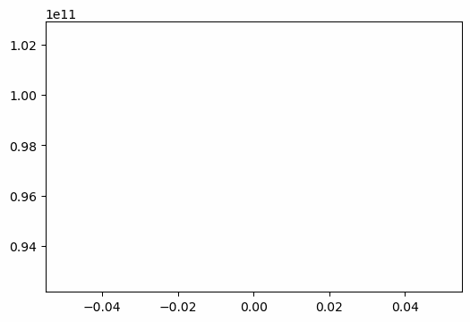

# [K-nearest-neighbour](https://github.com/Annamalaisaravanan/Machine-Learning/blob/master/k-means%20neighbour.py) 

  K-nearest neighbour is one of the Classification models in Machine Learning. I have used a Euclidean distance to calculate the closeness between two data points. Here the Iris Dataset contain four coordinates.
   
   The above code has been explained in the medium article. You can get the article [here](https://saravananannamalai4871.medium.com/k-means-neighbour-from-scratch-in-python-11c9ffc0e834).
   
   
# [Heart-attack-analysis](https://github.com/Annamalaisaravanan/Machine-Learning/blob/master/Heart_attack_analysis.ipynb)
         
  This Notebook contains a Exploratory Data Analysis of a Heart-attack dataset which contains 13 independent variables and one dependent variable. The different plots were plotted between different variables. Models such as LogisticRegression and KNeighborClassfier were fitted on to the dataset and model accuracy was calculated.
  
# [Linear-Regression-Scratch](https://github.com/Annamalaisaravanan/Machine-Learning/blob/master/Linear_Regression_Scratch.ipynb)

In this Notebook, I built the Linear Regression Model from Scratch using numpy. It is a simple linear regression model means it can only take one input parameter and gives the output. In the notebook you can find the linear class which contain all the function required for training and predicting the output. Gradient Descent algorithm is used to optimize the model and the loss function I used is mean_squared_error.

## Epochs vs Loss Function 

# [Logistic-Regression-Scratch](https://github.com/Annamalaisaravanan/Machine-Learning/blob/master/Logistic_Regression_Scratch.ipynb)

This Notebook contain the scratch implementation of Logistic Regression. It also done using numpy. It is mainly used for Classification problems. The logistic regression is similar to linear regression, besides it contain sigmoid function at the output.  Here the optimizer is Gradient Descent and the loss function is binary_crossentropy.
